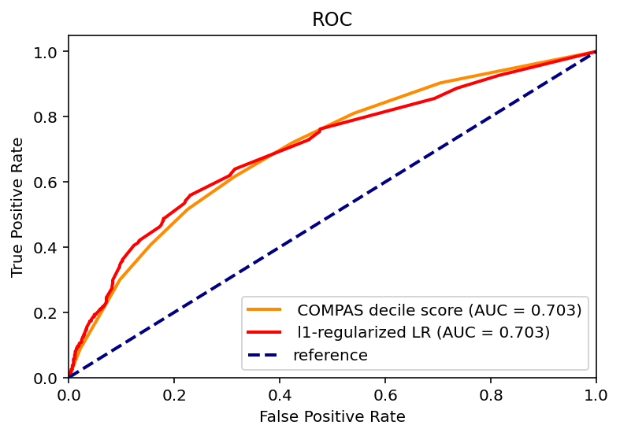
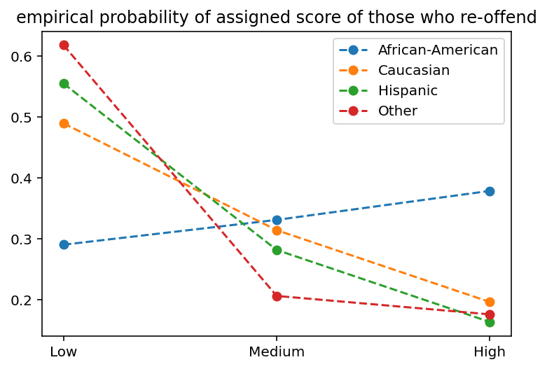
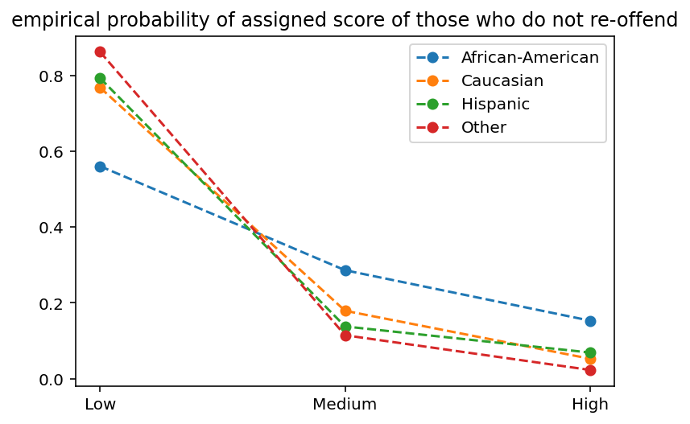
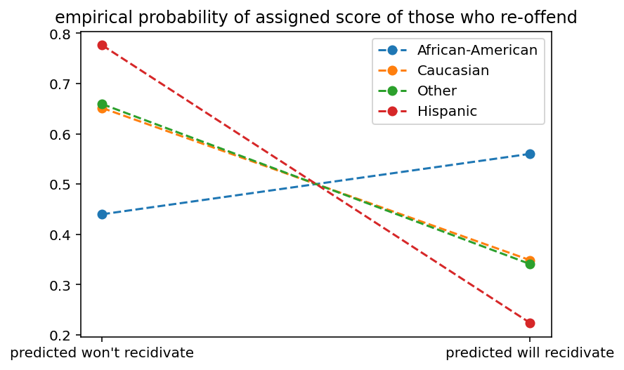
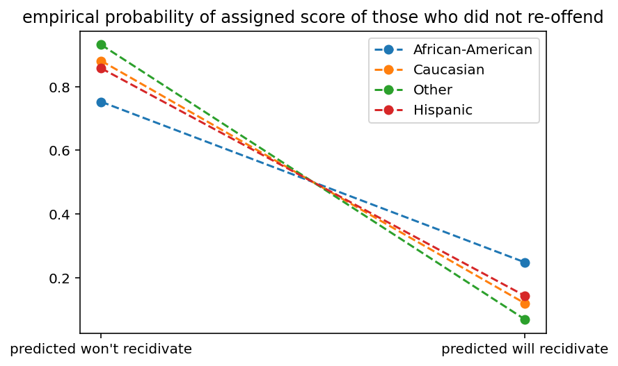
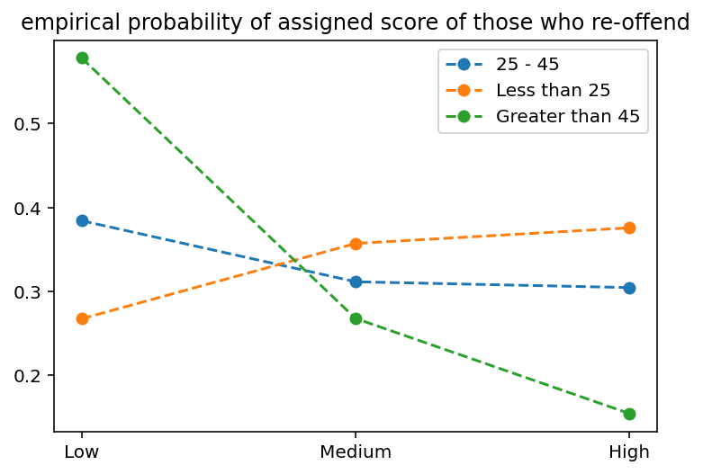
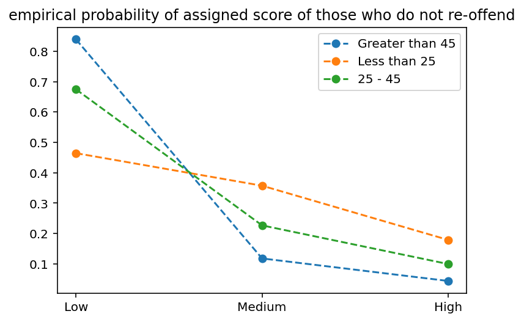
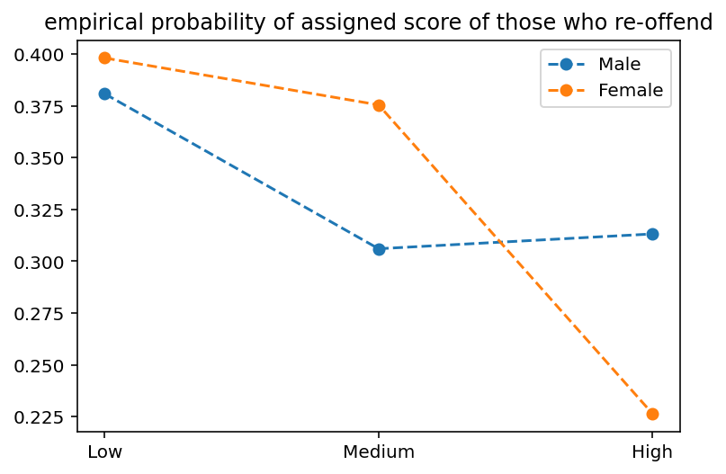
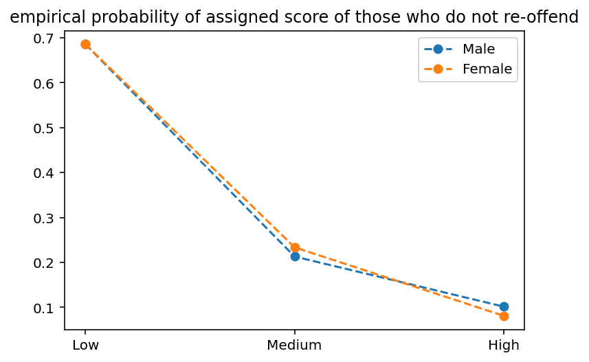

# Midterm report
## Introduction 
We recognize that a model like the COMPAS algorithm can be a “Weapon of Math Destruction”, as it satisfies the definitions: 1) its prediction outcome is not easily measurable, 2) false predictions of the model can cause serious trouble (reoffending or unnecessarily keeping the defendant in jail), 3) false predictions, especially false positive prediction becomes a negative feedback loop.

A common assumption made when we train ML models is that the data sample we collect is representative of the true population, i.e. we assume the distance between sample and population is negligible. However, in our task we should also be aware that the distance between population and ground truth is not negligible due to historical bias in our society. By ground truth, we are referring to the true recidivism tendency of individuals. In other words, we will always have a biased data sample as our population is inherently biased. 
 
Thus, we are interested in improving algorithmic fairness in COMPAS by:
Performed Feature Selections for Protected and Visible features
Quantify the inherent bias in the COMPAS algorithm 
Optimize the model by pre-process feature mapping and post-process raw output calibration 

## Feature Selection
To discuss the notion of fairness, we first introduce the idea of protected features and visible features. By protected features, we are referring to the features that we expect our ML models not to depend on when making predictions. We refer to the remaining features as visible features, as they are visible to the predictive models. Mathematically speaking, given any protected feature $d\in D$ and visible features , we expect . When the equation doesn’t hold true, we say the predictive model is biased and discriminatory. [[1]](https://alexeyignatiev.github.io/assets/pdf/icshms-cp20-preprint.pdf) 

### Protected Features Selection
We select protected features based on the US federal laws regarding discrimination. 
> **Race and Gender** [Civil right act of 1964] :
Also, Race and Gender are commonly deemed as the source of bias in the COMPAS datasets, which satisfies the function of protected features. We thus select both as our protected features.  

> **Age** [Age Discrimination in Employment Act of 1967]: 
In most of the work related to COMPAS dataset analysis, Age is not selected as a protected feature. We noticed that Age could be a candidate for protected feature when we spotted that Age is most inversely correlated with the COMPAS score. We then plotted the empirical probabilities with age as the protected features and we found the similar pattern in Age groups as we found in races: Inmates under 45 years old have a higher chance of receiving a high COMPAS score, compared to Inmates over 45 years old with similar visible features. This finding, as well as the increasing attention drawn to Ageism in the criminal justice system, motivates us to select Age as a protected feature. 

> When younger inmates are receiving harsher penalties as a result of biased metrics like COMPAS, their chances to be successfully reintegrated into the society are lessened due to the discrimination, with little exposure to and experience in life outside of jail. We aim to address the discrimination experienced by people in different age groups in this paper to contribute to the discourse of ageism in the criminal justice system and bias in COMPAS score. 

### Visible Features
Excluding the protected features from the dataset, we selected a subset of available features: 
- `juv_fel_count`: felony counts in an inmate’s juvenile years
- `juv_misd_count`: misdemeanor counts in an inmate’s juvenile years
- `juv_other_count`: related record counts in the criminal justice system in an inmate’s juvenile years
- `priors_count`: Number of priors related to an inmate’s record
- `c_charge_degree`: The inmate’s charged degree at the time the COMPAS screening is performed

Since recidivism prediction algorithms like COMPAS are commercial softwares with limited access, we use the selected visible features to train a simple supervised ML model as a representation of the risk assessment models. In addition, since our de-bias technique is model-agnostic, it is more intuitive to evaluate its performance indirectly by embedding it into a prediction task. 

The ROC curve above shows that a -regularized Logistic regression model can serve as a reasonable baseline risk assessment model in place of the original COMPAS model in our project. To evaluate the effectiveness of our de-bias technique, we will compare the difference between the performance of the risk assessment model with and without applying our de-bias technique. We will discuss the metrics for quantifying model performance in the "metric" section later. 
 
 *note, the prediction labels of the logistic regressor and the COMPAS system used in the ROC plot is different. We will elaborate on this in the next section.

## Defining target variable 

In COMPAS system, two types of risk ratings are presented to the human judges at court: decile scores, and risk suggestions (High risk, Medium risk, Low risk) based on the decile scores. In other words, COMPAS score will not predict whether the individual will recidivate or not. When discussing the discrimination in the COMPAS system, we consider the target variable as the level of risk predicted by COMPAS. When the COMPAS system says low risk and the individual did not recidivate, or when it says medium or high risk, and the individual actually recidivated, we consider it as a true negative; vice versa. 

However, in the rest of the project, we simplify the target to match with the ground truth labels, i.e. whether the inmate is predicted "will recidivate" and whether the inmate actually went on to recidivate after being released. This is also the case in our Logistic regression model. 

## Uncover the discrimination and bias that exists in the COMPAS Score

Without the loss of generality, we chose `Race` as the protected feature to visualize the bias in the COMPAS dataset. We validated the existence of racism in the COMPAS dataset by plotting the above empirical probability distributions of different race groups. For inmates who actually recidivated, Caucasians had a nearly 20% more chance of receiving a low COMPAS score than African Americans and  30% less chance of receiving a high COMPAS score. For inmates who didn’t commit crimes within the window of two years, African Americans have a 20% less chance to receive a low COMPAS score than other races. This illustrates the fact that COMPAS scores are biased towards overestimating the recidivism tendency of African Americans and underestimating the recidivism tendency of other races.

Similar to the discrimination spotted in race, we uncovered discrimination in `Sex` and `Age` Groups, with male and inmates under 25 as the victims of the bias in COMPAS. See Appendix for the corresponding visualizations.

For comparison, below is the empirical probability of being predicted as risky (will recidivate) or not risky (will not recidivate) by the logistic regression model for different racial groups. We can see that the logistic regression model displays similar levels of discimination as COMPAS. 

## Metrics for measuring the fairness and discrimination in the model 

We consider two kinds of fairness measures: group fairness and individual fairness.

### Group fairness [[2]](https://papers.nips.cc/paper/2017/file/9a49a25d845a483fae4be7e341368e36-Paper.pdf)

General speaking, for individuals from any two groups in the protected feature, e.g. an African-American individual and a Caucasian individual in the protected feature `race`, we expect a fair model to predict them to risky or not with similar probability. Mathematically, suppose we use distance measure function , protected feature , and prediction , the bias is measured by :

<!-- $$J(Pr(\hat{y}\in Y|d_1\in D),\enspace Pr(\hat{y}\in Y|d_2\in D))$$ -->

A fair model would have , where $\epsilon$ represents a small value. 

Note, since we have access to the ground truth label, we introduce a small tweak in the above formula to gain a better idea of the discrimination trend:

<!-- $$J(Pr(\hat{y}\in Y|d_1\in D, y=\text{will recividate}),\enspace Pr(\hat{y}\in Y|d_2\in D, y=\text{will recividate}))$$
$$J(Pr(\hat{y}\in Y|d_1\in D, y=\text{won't recividate}),\enspace Pr(\hat{y}\in Y|d_2\in D, y=\text{won't recividate}))$$ -->

For a fair model, we expect it to have similar performance for any two groups of the protected features, i.e. very small  value. 

**Choice of distance measure **:

We use the idea of Disparate Impact to quantify the COMPAS scoring bias: Disparate Impact, also interpreted as Indirect Discrimination, happens when the protected features are not the direct cause of a judicial decision but they actually have strong correlation to the decision. Measuring the degrees of disparate impact can help examine the bias in the COMPAS dataset. Motivated by the famous 80% rule in sociology, we set 

<!-- $$J(p,\enspace q)=|\frac{p}{q}-1|$$ -->

for probabilities $p$ and $q$. When we take ,  represents the 80% rule. 

Another group fairness measure we're interested in is Demographic Parity: a measurement very similar to the disparate impact calculation except we care more about the distance between probabilities than the ratio. This is accomplished by setting

<!-- $$J(p,\enspace q)=|p-q|$$ -->

### Individual Fairness [[3]](https://arxiv.org/abs/2001.09784)

In the previous sections, we calculated the amount of discrimination for different groups of inmates with identical protected features. However, to achieve individual fairness, inmates of the same visible features should be expected to have an identical judicial decision. 

Mathematically, this can be expressed as , where  is a distance function, and , are visible features of two data points. 

# Next steps
## Optimize the tradeoff between fairness and accuracy

We perform the optimization for fairness in two stages: 1) pre-process; 2) post-process.

### Preprocess [[2]](https://papers.nips.cc/paper/2017/file/9a49a25d845a483fae4be7e341368e36-Paper.pdf)
The goal of the preprocessing step is to find the best randomized mapping from the original data point to a perturbed data point with minimum distortion for each data point in the training set that enables the subsequent model trained to be fairer. To accomplish the goal, we define the following objectives.

**Utility Loss**: In other words, how much valuable information is lost due to the preprocessing step? Since we are distorting the original dataset, we are potentially losing information and introducing artificial signals to the original dataset. Therefore, we would like to measure the difference between the dataset before and after the randomized mapping, which can be done by measuring the distance between the empirical probability distributions with methods like KL-divergence. To minimize the loss of information and added artificial signals, we want to minimize this difference. Mathematically, the objective can be expressed as: 

<!-- $$f(Pr(X,Y),Pr(X',Y'))$$ -->

where $f$ is a dissimilarity measuring function, e.g. KL-divergence.

**Individual Distortion**: Similar to the idea of minimizing utility loss, we also want to ensure that individual data points are not significantly different after the preprocessing step. To minimize the distortion in individual samples, we minimize the expected difference between data samples before and after the preprocessing step. Mathematically, this can be expressed as the expected distance between each individual data point before and after preprocessing:

<!-- $$\mathbb{E}[\delta((x,y),(x',y'))],\enspace\forall (d,x,y)\in D\times X\times Y$$ -->

where $\delta(\cdot,\cdot)$ is a distance function. 

[Optimized Pre-Processing for Discrimination Prevention](https://papers.nips.cc/paper/2017/file/9a49a25d845a483fae4be7e341368e36-Paper.pdf) states that the optimal mapping can be found through solving the convex optimization problem below:

<!-- $$\min f(Pr(X,Y), Pr(X', Y'))$$
$$\text{s.t. } J(Pr(\hat{y}\in Y|d_1\in D),\enspace Pr(\hat{y}\in Y|d_2\in D))\leq \epsilon_1$$
$$\mathbb{E}[\delta((x,y),(x',y'))]\leq \epsilon_{2,d},\enspace\forall (d,x,y)\in D\times X\times Y$$  -->

### Postprocess [[4]](https://arxiv.org/abs/1701.08230)
First, we define the idea of a decision function: a function that maps from raw output of risk assessment models to suggestion to human judges. 

Essentially this step can be viewed as calibrating the risk assessment model output so that it is fair across different groups in protected features without sacrificing too much of accuracy. 

# Appendix
## discrimination with respect to other protected features visualized

